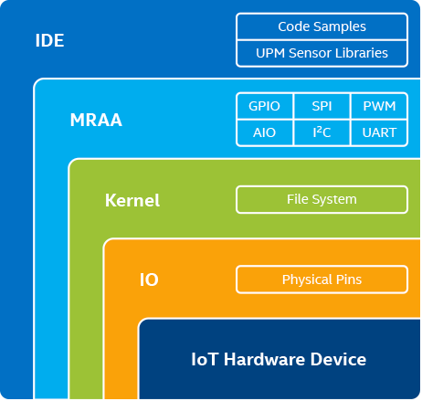
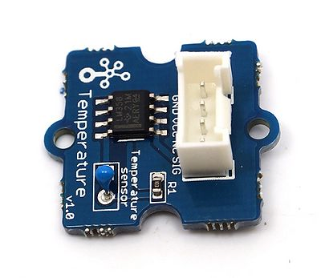
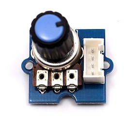

# Overview of MRAA and UPM Library

## What is the MRAA Library?

Libmraa is a C/C++ library with bindings to Java, Python and JavaScript to interface with the IO on a variety of IoT boards. Use of libmraa abstracts your specific hardware and uses board detection at runtime to create portable code that will work across many supported platforms.

The intent is to make it easier for developers and sensor manufacturers to map their sensors & actuators on top of supported hardware and to allow control of low level communication protocol by high level languages & constructs.

**The MRAA/UPM Advantage is that the developer can write sensor/actuator code in a language of their choice and the MRAA/UPM API abstracts the hardware making it portable to a variety of IoT boards.** 

##### Further Information
- [MRAA on Github](https://github.com/intel-iot-devkit/mraa)
- [MRAA Homepage](http://mraa.io/)

## Architecture of I/O using MRRA and UPM
MRRA and UPM are application level libraries that are used in IoT applications to communicate with sensors and actuators.

Here's is a diagram showing the relations between the hardware and the IoT application.

The MRAA library provides abstractions for the following I/O types:
 * [General Purpose Input and Output (GPIO)](https://en.wikipedia.org/wiki/General-purpose_input/output)
 * Analog I/O - uses an [Analog to Digital Converter](https://en.wikipedia.org/wiki/Analog-to-digital_converter) to convert to and Arduino standard 10 bit value (0 to 1023).
 * [Pulse Width Modulation (PWM)](https://en.wikipedia.org/wiki/Pulse-width_modulation)
 * [Inter-integrate Circuit (I2C)](https://en.wikipedia.org/wiki/I%C2%B2C)
 * [Serial Peripheral Interface Bus (SPI)](https://en.wikipedia.org/wiki/Serial_Peripheral_Interface_Bus)
 * [Universal asynchronous receiver-transmitter (UART)](https://en.wikipedia.org/wiki/Universal_asynchronous_receiver-transmitter)

Together these interfaces provide an I/O layer that can support many devices that sensor and take actions in a physical environment.

Two IDEs that have support for the MRAA and UPM libraries are [Arduino Create](https://create.rduino.cc) and [Intel System Studio](). However, since MRAA and UPM include bindings for Java, Python, JavaScript, C++ and C, you can, of course, use an IDE or editor of your choice.

## Open the MRAA API Documentation
We will now open the API Documentation page for the MRAA C++ library. Please, keep this page open as you will refer to it during the rest of the lab exercises.

 **Open the [MRAA API Documentation page for C++](https://iotdk.intel.com/docs/master/mraa/)**

If you are interested you can also open the API Reference pages for other language bindings.
* [MRAA API Documentation for Java](https://iotdk.intel.com/docs/master/mraa/java/)
* [MRAA API Documentation for Python](https://iotdk.intel.com/docs/master/mraa/python/)
* [MRAA API Documentation for JavaScript](https://iotdk.intel.com/docs/master/mraa/node/)

## What is the UPM Library?

UPM is a sensor library with high-level APIs that make it easy to connect and use sensors and actuators in IoT solutions. Sensors and actuators are exposed as high-level C++ objects that are built upon lower-level MRAA API calls. Each sensor contains a header which allows to interface with it. Typically a sensor is represented as a class and instantiated.

The constructor is expected to initialize the sensor and parameters may be used to provide identification/pin location on the board.

Typically an update() function will be called in order to get new data from the sensor in order to reduce load when doing multiple reads to sensor data.

## UPM Advantage

|        Category  | Details          |
|------------------|------------------|
| Language support | C/C++, Java*, Node.js*, Python*| 
| OS support | Wind River* Intelligent Device Platform XT, Wind River Pulsar* Linux*, Yocto*, Ubuntu*, Android*, Zephyr* RTOS, OpenSUSE*| 
| Connectivity options | Wi-Fi, Bluetooth® low energy, ZigBee*, Z-Wave*, LoRa*, Modbus, BACnet*, GPS, GPRS, NFC/RFID, SigFox*, LoRaWAN*, 4G/LTE*| 
| Protocols | GPIO, AIO, PWM, I2C, SPI, UART, 1-Wire* | 
| Portable | Go from prototype to product with minimal rework | 
| License | MIT-licensed | 
| # of Sensors Supported | More than 400 supported sensors and actuators| 
| Distribution Channels | MRAA and UPM packages are available for multiple OS distributions and architectures, including OPKG repository, Ubuntu PPA, 01.org, NPM*, and Maven*|
| Community and Ecosystem | Intel provides ongoing training and support for IoT developers—expanding the application pool for sensor manufacturers, ISVs, and SIs. At the same time, the Intel® Internet of Things Solutions Alliance allows sensor manufacturers to expand their customer base and connect with developers|

## Become familiar with MRAA and UPM Online Resources

Let's begin by opening three important reference pages.

 **Open the [Sensors page ](https://iotdk.intel.com/docs/master/mraa/) on the Intel Developer Zone**

The sensors page will link to articles related to sensor and actuator support, as well as, a list of industrial sensors that are supported

 **Open the [UPM](https://upm.mraa.io/)**

 **Open the [UPM Sensor Finder page](https://upm.mraa.io/findSensor.html)**

Take some time to look up a couple of sensors or actuators that are of interested to you.

 Look up the [Grove Temperature Sensor](https://upm.mraa.io/sensorDetail.html?name=Temperature) in your kit.

 Look up the [Grove Rotary Angle Sensor](https://upm.mraa.io/sensorDetail.html?name=rotary) in your kit.

